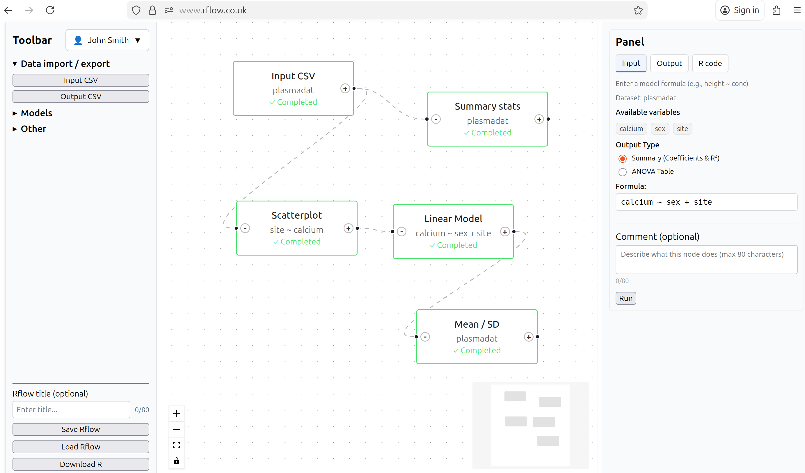

# Welcome to Rflow^&ZeroWidthSpace;[®]{.trademark}^ {.mt-1}


::: {.columns}

::: {.column width="55%"}
### No-code data science for R users

- Drag and drop intuitive flowchart interface to build your data science pipeline.
- Online platform to run your Rflow workflow in the cloud
- Share your workflows with other Rflow users through the Rflow project dashboard.
- Export your Rflow workflow to a reproducible R script for further analysis and customisation.
- No lock-in to Rflow, you can run your exported R scripts in RStudio or other IDEs.
- Uses popular leading R packages for data science including [ggplot2](https://ggplot2.tidyverse.org), [glmmTMB](https://cran.r-project.org/web/packages/glmmTMB/index.html), [DHARMa](https://cran.r-project.org/web/packages/DHARMa/index.html) and [car](https://cran.r-project.org/web/packages/car/index.html).
- Extensive tutorials and training materials to help you get started with Rflow and R programming.

### Visualise. Analyse. Interpret. Reproducible data science in R with flowcharts.

### Launching Autumn 2026


::: {.d-flex .flex-wrap .gap-4 .pb-3 .pt-4}
[Start for Free](https://rflow.co.uk/signup){#btn-start .btn-action-primary .btn-action .btn .btn-lg .rounded-pill role="button"}
[Guide](/docs/index.qmd){#btn-guide .btn-action .btn-secondary .btn .btn-lg .rounded-pill role="button"}
:::


:::

::: {.column width="45%"}

::: {style="display:flex; justify-content:center; align-items:center; height:100%;"}

```{=html}
<video id="myVideo" autoplay muted playsinline
       style="max-width:100%; max-height:100%;">
  <source src="images/data_concepts.mp4" type="video/mp4">
</video>

<script>
  const video = document.getElementById('myVideo');

  video.addEventListener('ended', () => {
    setTimeout(() => {
      video.currentTime = 0;
      video.play();
    }, 2000);
  });
</script>
```
:::
:::

::: {.columns}

::: {.column width="33%"}
#### Easy to learn

- Simple drag and drop interface
- No prior coding experience required
- Extensive tutorials and training materials
- Unified approach to statistics
- Tests as (generalised) linear models
:::

::: {.column width="33%"}
#### Reproducible

- Share your workflows with other Rflow users via Rflow project dashboard
- Use Rflow to create reproducible data science workflows
- Export your workflow to a reproducible R script
- Customise your R scripts later in RStudio or other IDEs
:::

::: {.column width="33%"}
#### Visualise and interpret

- Visualise your data using ggplot2
- Scatterplots, boxplots, histograms, barplots and more
- Visualise model diagnostics using DHARMa
- Store model outpus for predictions
:::

:::

## See Rflow in Action

Build complex workflows in minutes, not hours

::: {style="text-align:center;"}
{width="90%"}
:::

## How It Works

  1. Drag & Drop Nodes: Select from the toolbar and add analysis nodes (CSV import, transformations, visualizations, models)
  2. Connect Your Workflow: Draw edges between nodes to define data flow from step to step
  3. Export R Code: Click export to get production-ready R code that you can run in RStudio or anywhere R runs

::: {.columns}

::: {style="text-align: center;"}
## Perfect for 

### Rflow is designed for anyone working with R
:::

::: {layout-ncol=3}
::: {.feature-card}
### Students

#### Data analysis learning

Learn R by example. See the generated code from your visual workflow to understand R syntax. Extensive tutorials and training materials to help you start with Rflow and R programming.
:::

::: {.feature-card}
### Researchers

#### Scientific research

If you are more familiar with SPSS, SAS, Stata, Minitab or other GUI-based software, Rflow provides a simple and intuitive interface to perform data analysis in R. Export your workflow as an R script for further analysis and customisation.
:::

::: {.feature-card}
### Data scientists

#### Quick prototyping

Rapidly prototype your data analysis workflow via Rflow's visual interface. Export to R when ready for further customisation.
:::

:::


:::

:::

