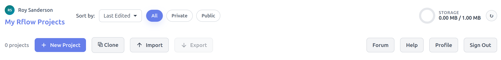
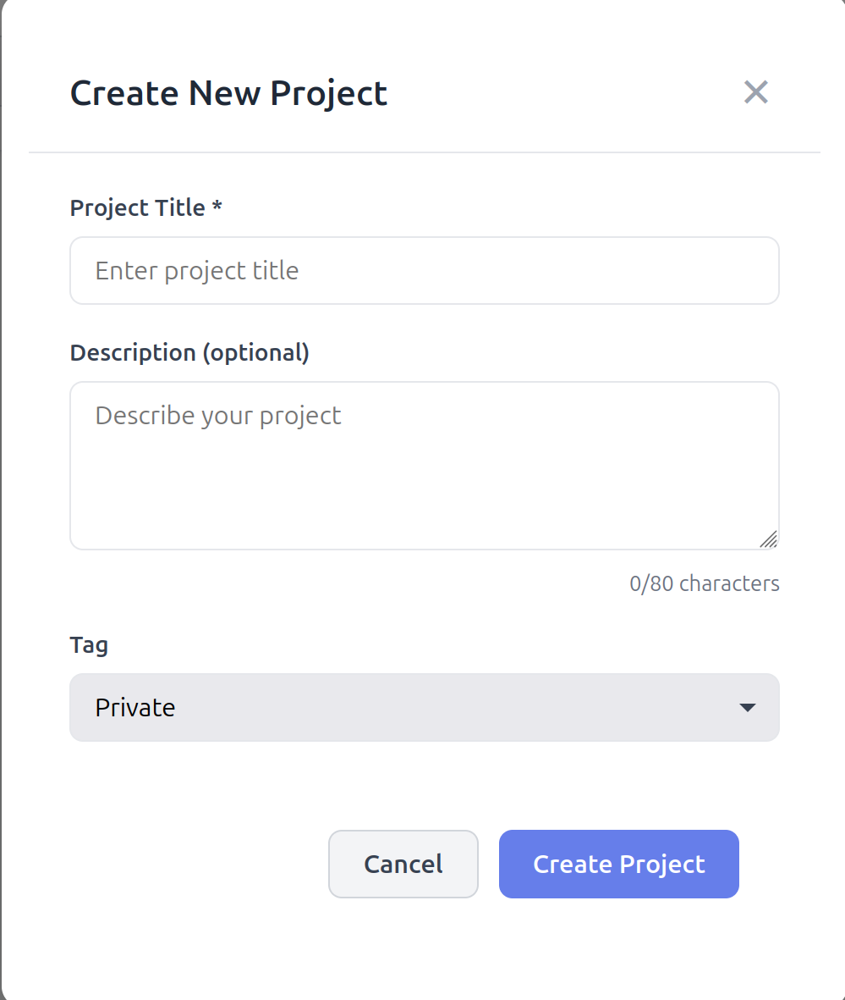
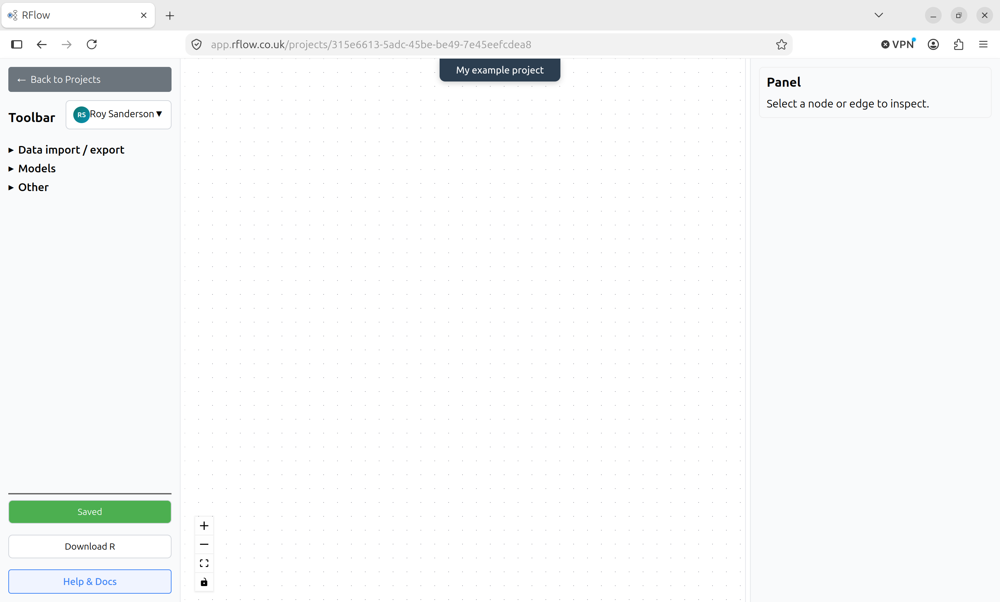
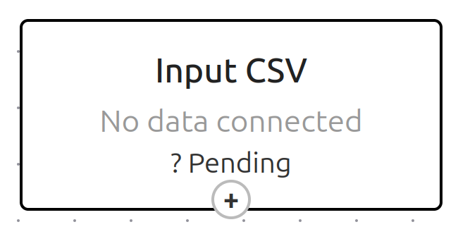
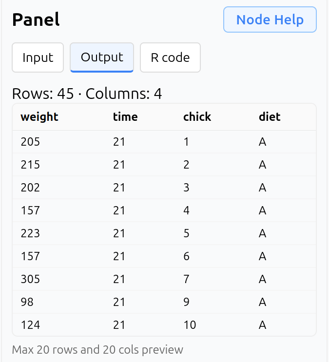
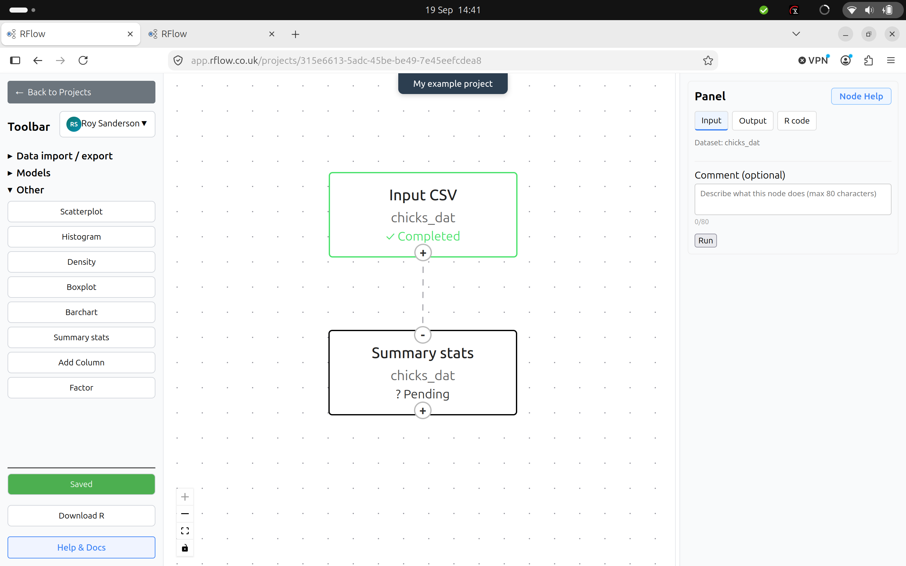
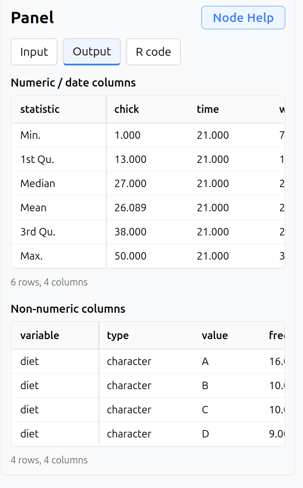

# The Rflow interface
The Rflow interface is designed to be intuitive and user-friendly, allowing users to easily create and manage their data analysis workflows. The first time you login to Rflow you will land on the Rflow Projects page, which lists all your Rflow projects. This will be empty of projects initially.

## Rflow Projects Ribbon
Across the top of the Rflow Projects page is the Rflow Projects ribbon, which contains buttons for creating a new project, cloning an existing project, access account settings etc. 

{width=100% fig-align="center"}

The key buttons on the Rflow Projects ribbon are:

* **New Project**: Create a new Rflow project. You will be prompted to enter a name for your project, a short description, and whether you want it to be a private project (default) or public project.
* **Clone**: This allows you to clone an existing Public Rflow project, or Tutorial project, into your own Rflow account where you can edit it. You cannot directly edit Public Rflow projects or Tutorial projects. When you Clone a project you also import that project's data, as well as its workflow.
* **Import**: This allows you to import an Rflow project format file (.json format) into your Rflow account. Rflow Project Format files contain the workflow structure, but **not** the data. They can be useful if you want to share a workflow with another Rflow user without making it public.
* **Export**: The reverse of Import, this generates an Rflow Project Format File that you can share with another Rflow user (e.g. via email). Again, the data is not included in the exported file, only the workflow structure, so you have to share any data separately.
* **Forum**: Provides access to the Rflow Community Forum for asking questions, sharing ideas, and getting help from other Rflow users. Note: this is currently hosted on Discourse, and you will need to create a free Discourse account to post questions or comments. You can also browse the forum without an account.
* **Help**: Access the main Rflow documentation pages
* **Account**: Access your Rflow account settings, including changing your password, upgrade to a paid Standard account (or downgrade to a Free account).

At the top right is an indicator of your current disk usage relative to your account's disk quota (press the refresh button to update information).

# Create an example Rflow project
To get started with Rflow, we will create a new project and import some example data. Click on the **New Project** button and you will be greeted with the following dialog box:

{width=40% fig-align="center"}

Enter a name for your project, such as _My first Rflow project_ and a short description. Leave it on the default Private setting for now, click **Create project** and you will be taken back to the Rflow Projects page, where you will see your new project listed as a "card". The info card gives the project name, creation and last modified dates, disk usage, and whether it is a private or public project. Also on the card are buttons for:

* **Open**: Opens the project in the Rflow workflow editor
* **Edit**: Allows you to edit the project name, description, and privacy setting
* **Delete**: Deletes the project and all its data. **This cannot be undone!**

# Rflow workflow editor
Click on the **Open** button on your testproject card to open the Rflow workflow editor.

{width=100% fig-align="center"}

This is the main Rflow workflow editor interface. The workflow editor is where you will create and manage your data analysis workflows. The main components of the workflow editor are:

## Toolbar
Allows you to select Rflow workflow nodes from dropdown menus. These are grouped into:

### Data import / export nodes
You will typically start your workflow with a data import node, which allows you to import data from a CSV file, or from an Rflow project dataset. You can also export your workflow results to a CSV file, or to an Rflow project dataset.

### Models
Here you can select nodes for fitting linear models, generalised linear models, check model diagnostics, make predictions, as well as calculate means and other statistics.

### Other
These focus primarily on data visualisation, including scatterplots, line plots, bar charts, and boxplots. There are also functions to summarise data, manipulate data types etc.

At the bottom of the Toolbar are three buttons: **Save, Download R, Help & Docs**. Your Rflow workflow is automatically saved to the server every 30 seconds, but you can click the **Save** button to save your workflow manually at any time. The **Download R** button allows you to download the R code for your workflow, which you can run in RStudio or any other R environment. Note that the Download R button only saves the R code, it does not save any data or analytical results. The **Help & Docs** button takes you to the main Rflow documentation pages.

There is also a dropdown menu at the top of the Toolbar next to your username. This shows you your total disk usage, the project's disk usage, and under **Manage project storage** shows you every R object saved to the Rflow server in this project. You can manually delete these at any time to free up disk space, but note that this will reset the Rflow nodes associated with that R object.

## Rflow canvas
Here you will build your workflow by dragging and dropping nodes from the Toolbar onto the canvas, and connecting them together to define the data flow. You can also move nodes around on the canvas, and delete nodes by selecting them and pressing the **Delete** key on your keyboard. If you do delete a node, any "downstream" nodes that depend on it will need to be re-run with new inputs. Each node has three states:

* **Pending**: The node has yet to be configured and run. Shown in grey on the Rflow canvas.
* **Completed**: The node has run successfully without errors. Shown in green on the Rflow canvas.
* **Error**: The node has run with errors. Shown in red on the Rflow canvas

Every node has at least one "handle" at the top and / or bottom of the node. Handles with a **+** sign are outputs. The node will output data and / or model results to a suitable downstream node. Handles with a **-** sign expect to receive information from an upstream node. You can drag and drop a connection with the mouse from an output handle to an input handle to connect two nodes together. You can also delete a connection by clicking on it and pressing the **Delete** key on your keyboard. Some nodes have multiple input and output handles, which allow you to connect multiple nodes together in a workflow. Other nodes only accept certain types of inputs from upstream nodes, and will not allow you to connect incompatible nodes together.

## Rflow Panel
This is on the right side of the Rflow workflow editor. It shows you the details of the currently selected node. When a node is selected, it will display 3 tabs:

* **Input**. You select the parameters needed to run the node, such as file names, model formulae, plotting instructions etc. You are strongly recommended to complete the optional **Comments** field to document your workflow. This will also be included in R code if you export it. At the bottom of the Input tab is a **Run** button, which you click to run the node. If the node runs successfully, it will turn green on the Rflow canvas.
* **Output**. This shows you the output of the node, such as summary tables, model results, and plots.
* **R Code**. This provides access to the R code generated only by this node.

At the top right of the Rflow Panel is a **Node Help** button which opens a new window with specific Rflow and R documentation about the functions of that selected node.

# Create a simple workflow
## Data import
Begin by clicking on the **Data import / export** dropdown menu in the Toolbar, and selecting **Import CSV**. You will be prompted to click on the main Rflow canvas to place the node.

{width=33% fig-align="center"}

You can see that the node is in a **Pending** state as it has not yet been configured and run. Click on the node to select it. You will now see in the Rflow Panel that it expects a CSV file to be uploaded. You also need to provide a name for the resulting R object (a `data.frame`) that will store that data in your workspace, as well as an optional comment. Download the following example CSV [chick_diet.csv](data_workflows/chick_diet.csv){download=""} to your computer. In Rflow, browse for that file, and give it an R object name of `chicks_dat`. R has certain rules for naming objects, which Rflow will check. It will also warn you if you try to use an R object name that already exists in your workspace. When ready, click the **Run** button at the bottom of the Rflow Panel. If the node runs successfully, it will turn green on the Rflow canvas with the message "Completed". The Rflow Panel Output tab will now show you the top few rows of the imported data.

{width=50% fig-align="center"}

If you click on the **R Code** tab, you will see the R code generated by this node. You can copy and paste this code into RStudio or any other R environment to run it there. **Note**: you will need to change the file path in the `read.csv()` function to point to the location of the CSV file on your computer as RStudio may not detect its location automatically.

## Summary statistics
Now we will calculate some very simple summary statistics. Open up the **Other** dropdown menu in the Rflow Toolbar, and click on ** Summary Stats**. Click on the Rflow canvas below your existing node, and connect the output handle of the **Import CSV** node to the input handle of the **Summary Stats** node. Your screen should now look like this:

{width=100% fig-align="center"}

Note that as soon as you connect the nodes, the Summary Stats node detects the `chicks_dat` object from the upstream node. Summary Stats has an output handle (it would just pass `chicks_dat` unchanged to any downstream nodes). It is very simple, and only needs a comment, before running. Add a comment, and click the "Run" button in the Rflow Panel.

{width=50% fig-align="center"}

As the `chicks_dat` contains a mixture of numeric and categorical data, these are presented neatly in the Output tab of the Rflow Panel. The numeric data is summarised with the mean, standard deviation, minimum, maximum, and quartiles. As usual you can click on the **R Code** tab to see the R code generated by this node.

# Finishing up
This is just a simple example of the most basic of workflows. The project is automatically saved to the Rflow server, but if interested, click the "Download R" button in the Toolbar to download the auto-generated R code for this workflow. You can sign-out of Rflow either via the dropdown menu next to your username, or by going back to the Rflow Projects page and clicking on the "Sign out" button at the top right of the page. You can always sign back in later to continue working on your workflow.