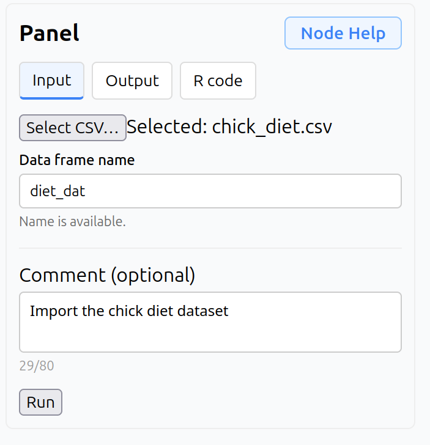
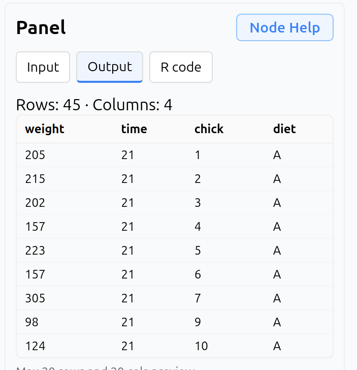
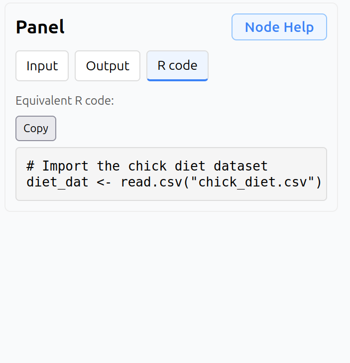
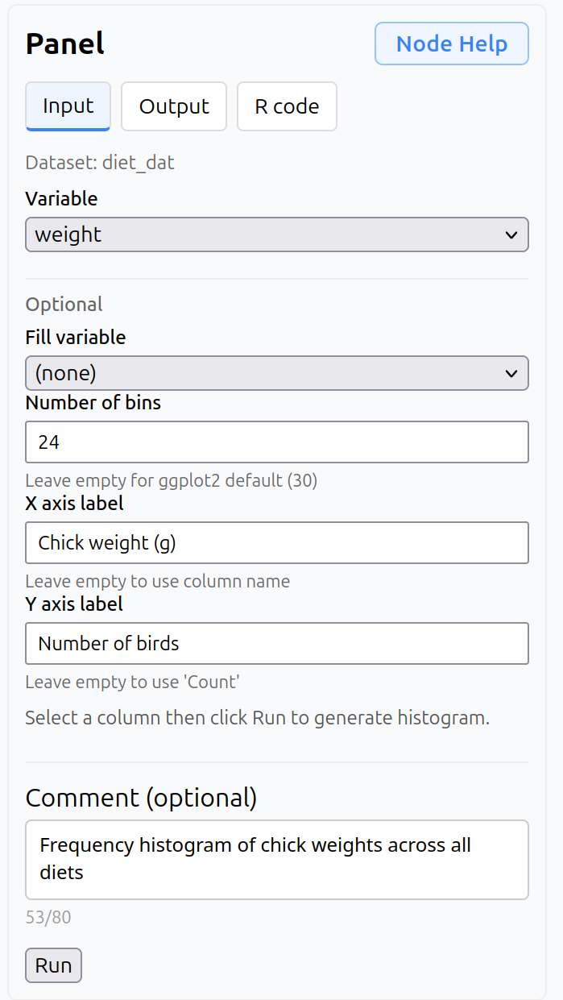
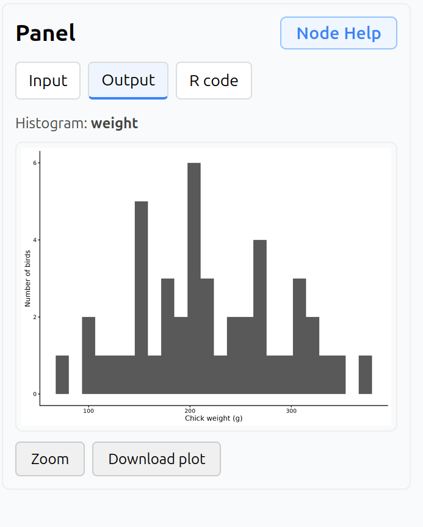
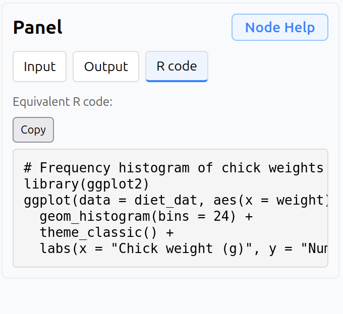

# Learning Objectives
This tutorial will introduce you to the basics of Rflow, specifically:

* Creating a simple Rflow workflow
* Importing data into Rflow
* Display summary tables about your data
* Simple visualisations of your data including histograms, density plots, boxplots and barcharts
* Saving your workflow, and exporting an R script.

# How to use this tutorial
You have a choice of either cloning a pre-prepared copy of this tutorial, which has all the necessary Rflow nodes already setup for you, of building your own from scratch by following the instructions. You will probably find it easier to start by cloning the pre-prepared tutorial, and then later building your own workflow from scratch.

# The example dataset
We will use a simple dataset of the weights, after 21 days, of 50 chicks fed on 4 different diets. As is common in many environmental and biological datasets, it is unbalanced, with different numbers of chicks fed each diet. The data can be downloaded from [download chick_diet.csv](data_workflows/chick_diet.csv){download=""}. The dataset has 4 columns:

* `weight` - the weight of the chick after 21 days (in grams)
* `time` - the time in days (always 21 in this dataset)
* `chick` - the ID of the chick (1 to 50)
* `diet` - the diet fed to the chick (A to D)

# Why not use a Microsoft Excel spreadsheet?
You may be wondering why we are going to import a CSV file rather than a Microsoft Excel (.xlsx) spreadsheet directly. R does now provide additional libraries such as `readxl` that can import Excel spreadsheets. However, we generally prefer CSV files; Excel spreadsheets can contain "gotchas" such has merged rows and columns, forumale, multple sheets etc. which can make them tricky to import. CSV files are very simple text-based format, with each column separated by a comma (CSV is "comma separated values"). They are also more portable, and can be opened in any text editor or spreadsheet software. For these reasons, we generally prefer to use CSV files for data import.

# How to convert an Excel spreadsheet to a CSV file
If you have a Microsoft Excel spreadsheet that you want to convert to a CSV file, you can do this by opening the spreadsheet in Excel, and then using the "Save As" option to save it as a CSV file. In Excel, you can do this by clicking on "File" > "Save As" > "Browse" > "Save as type" and then selecting "CSV (Comma delimited) (*.csv)" from the dropdown menu. You can then choose a location to save the file, and click "Save". You may get a warning that some features of your spreadsheet may be lost if you save it as a CSV file.

# Step-by-step instructions
## Step 1: Create a new Rflow workflow
We will do this by cloning a pre-prepared workflow. On the Rflow Projects page, click on the "Clone" button and search for "Tutorial 1A" which is authored by "RflowAdmin". When you find it, click on the green "Clone" button:

{width=25% fig-align="center"}

After clicking the "Clone" button, click on the "My Projects" button to display your own Rflow projects. You should see the tutorial listed as "Tutorial 1A (Copy)". You can click its Edit button if you want to change its name or description. When ready, click on the "Open" button and you should see the pre-prepared workflow:

{width=50% fig-align="center"}

**Explanation**: Have a quick look at the workflow before we start running it. Reading from top to bottom, then left to right:

* Input CSV: imports your diet_data.csv into R

* Histogram: Frequency histogram of all the chick weights
* Density plot: Density plot of all the chick weights
* Boxplot: Boxplot of chick weights for each diet group
* Summary statistics: simple summary of the contents of your 4 
columns
* Mean / SD: calculates means, standard deviations, standard errors etc. for each diet group
* Barchart: bar chart of mean chick weights with error bars for each diet group

So the left side of the workflow broadly describes the "shape" of the data overall, while the right side gives you information about differences in chick weights with diet, both numerically and visually.

## Step 2: Import the chick_diet.csv dataset
Begin by clicking on the "Input CSV" node and in the Panel on the right, upload the `chick_diet.csv` dataset that you downloaded earlier. You'll need to give the R dataframe a name, and if you have cloned the Rflow workflow, downstream nodes will expect you to use `diet_dat` as the dataframe name. Add a comment, which is always good practice, to describe what the node does:

{width=25% fig-align="center"}

Click the **Run** button and you will see the following:

{width=25% fig-align="center"}

This provides a quick view of the first 20 rows of your R dataframe `diet_dat` and is useful to confirm that your data has been imported correctly. Next, click on the **R code** tab to see the R code that has been generated for this node:

{width=25% fig-align="center"}

There is the option to copy this code to the clipboard if you want to paste it directly into an R script in RStudio, Positron, VS Code or similar IDE, but we will skip this step for now. Notice also that the Input CSV node now has a green border and has changed from "Pending" to "Completed" to indicate that it has been run successfully.

## Step 3: Data visualisation
The left side of workflow allows you to visualise the shape of the chicks weights, stored in the `weight` column of the `diet_dat` dataframe. We use two popular visualisations: a frequency
 histogram and probability density plot. Finally, we use a boxplot to compare weights with different diets.

 ### Step 3a: Frequency histogram
 Click on the "Histogram" node and you should see the following on the Input tab of the Panel on the right:

 {width=25% fig-align="center"}

 A few things to note:

 * If you have cloned the workflow, all of the settings will already be completed
 * The node will have detected that `diet_dat` is the input dataframe
 * There is a drop-down menu to select the **continuouse** variable for which we want a frequency histogram, in this case `weight`.
 * There are a number of options available
 - **Fill variable** should you want multiple histograms in one plot, coloured by a categorical variable.
 - **Number of bins** This is the number of devisions on the x-axis, and you can accept the default of modify it (as done here).
 - **X** and **Y** axis labels. It is good practice to label your axes explicitly rather than accept the defaults.

 After running the node, you will see a preview of the frequency histogram in the Output tab of the Panel on the right:

 {width=25% fig-align="center"}

 Click on the **Zoom** button for a full-size image, and you can also download it as PNG format for import into Microsoft Word, PowerPoint etc. Finally, click on the **R code** tab to view the automatically generated R code for this node.

 {width=25% fig-align="center"}